# Cara Rakit Termometer Digital Non Kontak di rumah

Ini adalah prototipe, casing silahkan desain sendiri

## Kenapa
Akhir-akhir ini harga termometer digital non-kontak semakin mahal. Selain itu ada juga yang memang terdesak karena tidak ada barang di daerahnya. Ada juga yang membeli online sampai ke negeri Cina, menunggu pengiriman yang cukup lama.

Disini saya mencoba memberi alternatif untuk teman-teman yang berkeinginan untuk memrakit sendiri termometer digital non kontak.

Barang-barang yang akan dirakit, saya usahakan murah dan fleksibel.
Saya coba mencari sensor non-kontak di toko online seperti Tokopedia dan menemukan sensor MLX90614, sensor ini sudah di kalibrasi dari pabrik dengan tingkat akurasi yang tinggi (High/Medical).
Spek dapat dilihat pada https://www.hotmcu.com/infrared-thermometer-mlx90614-breakout-board-p-223.html

Untuk pengolahan input dari sensor tersebut, saya mencari harga yang paling murah dan memiliki fleksibilitas dalam hal akses pemrograman dan alternatif sumber daya. dengan antarmuka USB, prosesor ini dapat menggunakan sumber tenaga dari Charger HP (dengan kabel extension USB Male to Female), Powerbank, atau bahkan HP jika anda menggunakan Kabel OTG.

Untuk menampilkan hasil pengukuran, maka kita akan membutuhkan komponen LCD/OLED.

Dari hasil baca-baca saya, MLX90614 menggunakan I2C untuk komunikasi. Jadi semua komponen yang dibutuhkan akan disesuaikan dengan antarmuka tersebut.

## Kebutuhan
1. Sensor IR: MLX90614
2. Microprosesor: Digispark
3. Layar: OLED 0.91
4. Kabel: merah, hitam, 2 warna lain untuk pembeda (hijau/kuning)
5. Solder & timah (mohon maaf belum dapat alternatifnya)
6. Komputer (PC/Laptop) dengan perangkat lunak Arduino IDE

## Perakitan Komponen
1. Solder komponen disesuaikan input/output dengan kabel yang berbeda warna
2. Petunjuk pemasangan kabel dan komponen bisa dicek pada gambar dibawah
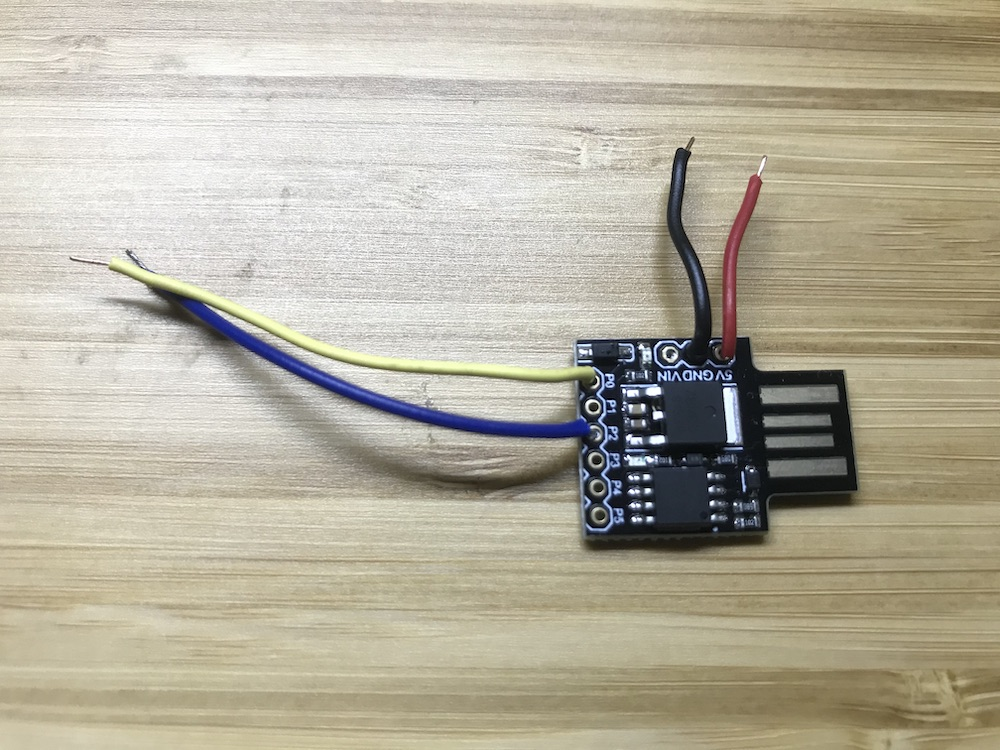
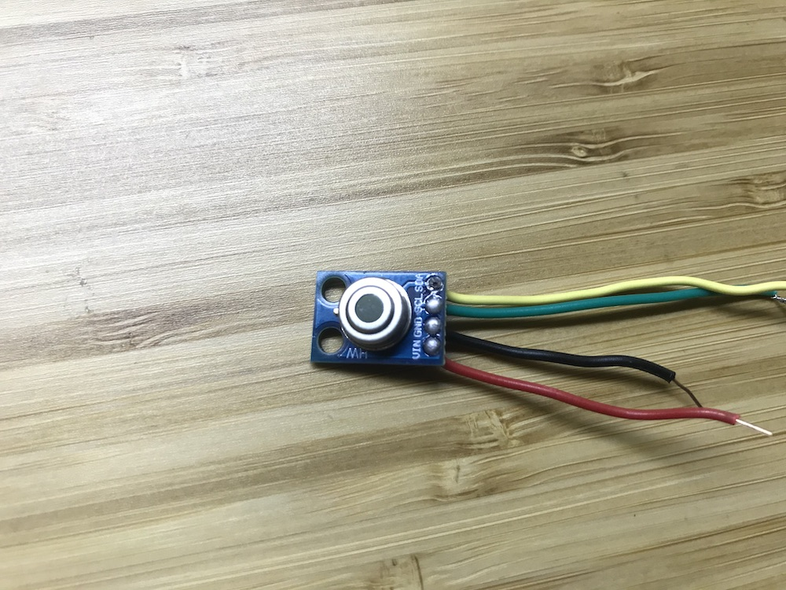
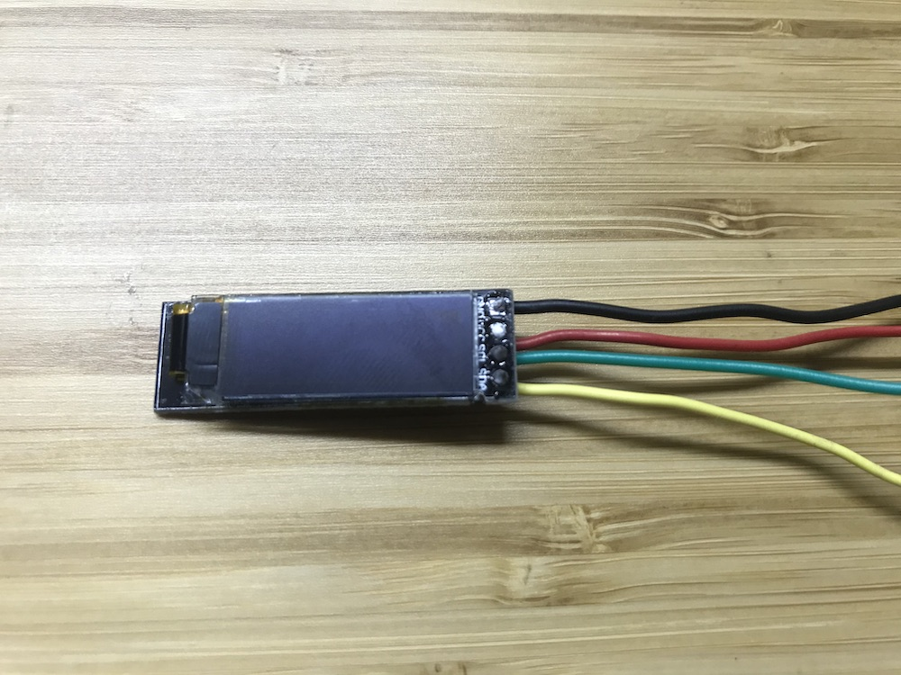
3. Video perakitan komponen: https://youtu.be/56fTAdGLMkY

## Langkah-langkah (Untuk MacOSX)
1. Beli komponen untuk dirakit
2. Rakit komponen yang sudah dibeli, lihat bagian "Perakitan komponen"
3. Pemrograman mikroprosesor, lihat bagian "Pemrograman Mikroprosesor"

## Pemrograman Mikroprosesor
1. Unduh program Arduino IDE sesuai laptop/komputer kalian di https://www.arduino.cc/en/main/software. kemudian install.
2. Setelah berhasil install, buka Arduino Preference. Lihat input "Additional Boards Manager URL:" dan masukkan http://digistump.comapackage_digistump_index.json
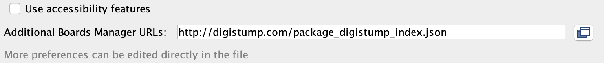
3. Buka Tools - Board Manager
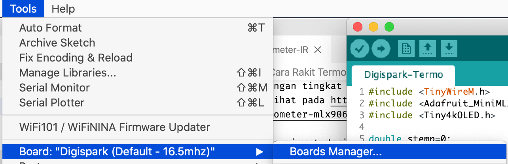
4. Cari Digispark pada input
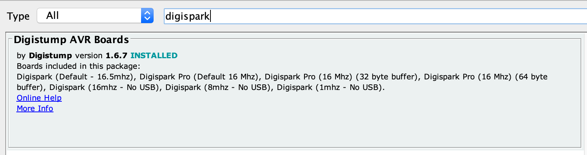
5. Pilih tipe Board

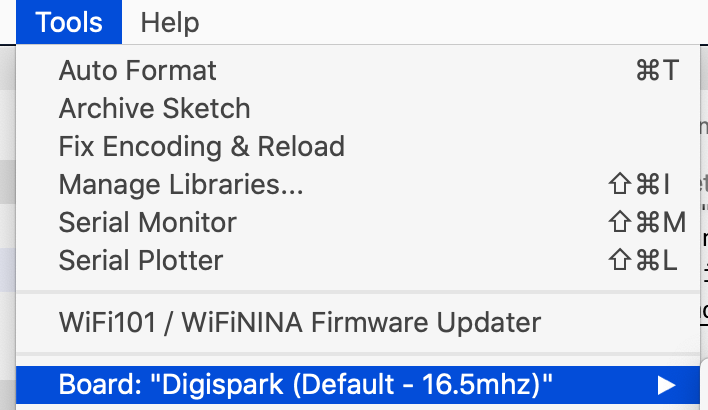

6. Unduh kode pada folder `code/termo.ino` -> https://github.com/zufrizalyordan/termo/blob/master/code/termo.ino . kemudian klik untuk membukanya di Arduino IDE
7. Compile terlebih dahulu untuk verifikasi kode. 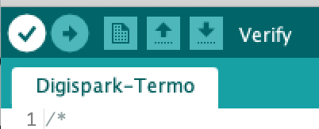
8. Unggah kode ke Digispark ATTiny. lihat "Unggah Kode"

## Unggah Kode
- Pastikan Digispark tidak tercolok ke USB
- Unggah kode
- Kode berhasil ketika tidak ada pesan kesalahan dan layar OLED berhasil menampilkan suhu

### Link cepat untuk membeli kebutuhan
Silahkan pilih sendiri mau beli dari toko yang mana ya.
1. Sensor Temperatur: https://www.tokopedia.com/search?source=universe&st=product&origin_filter=sort_price&ob=3&q=mlx90614
2. Digispark ATTiny85: https://www.tokopedia.com/search?st=product&ob=3&q=digispark%20attiny85
3. OLED: https://www.tokopedia.com/search?st=product&ob=3&q=Oled%20Display%200.91
4. Kabel extension USB Male to Female: https://www.tokopedia.com/search?st=product&pmin=8800&origin_filter=sort_price&ob=3&q=usb%20extension

#### Catatan kaki
- Kalo ada yang nemu lebih murah di platform online lain, silahkan saja. link diatas hanya untuk kemudahan teman-teman.
- Saya tidak di endorse ya sama Tokopedia, cuman sering belanja disana aja.
- Kode akan mengambil 5 pengukuran, kemudian menampilkan nilai maksimal dari hasil pengukuran tersebut.

### Video
- Perakitan: https://www.youtube.com/watch?v=56fTAdGLMkY
- Casing & Testing: https://youtu.be/uesPk8TWKTU

### Foto-Foto
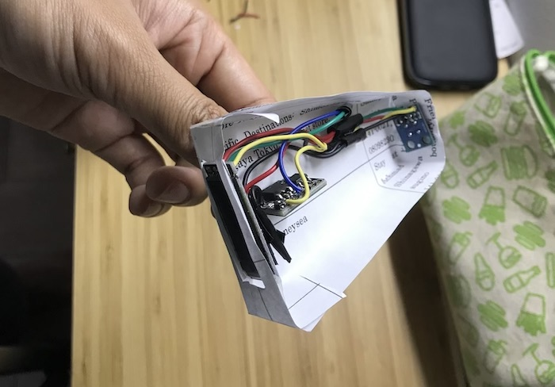
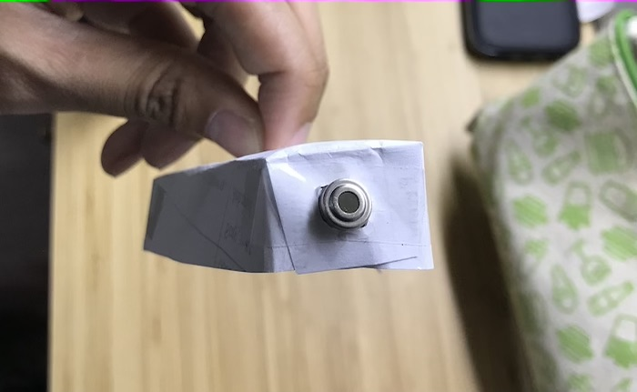
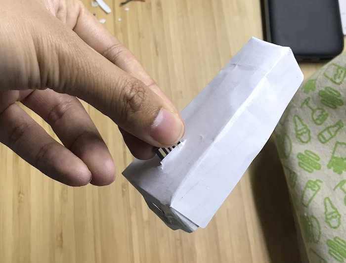